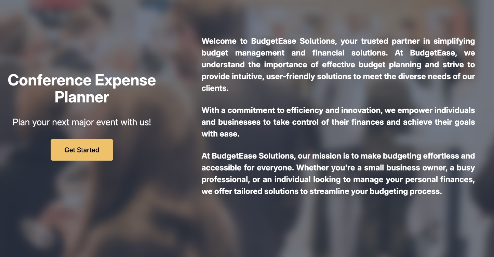
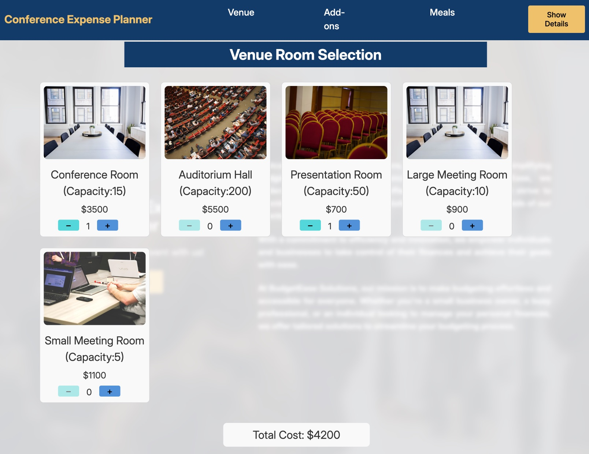
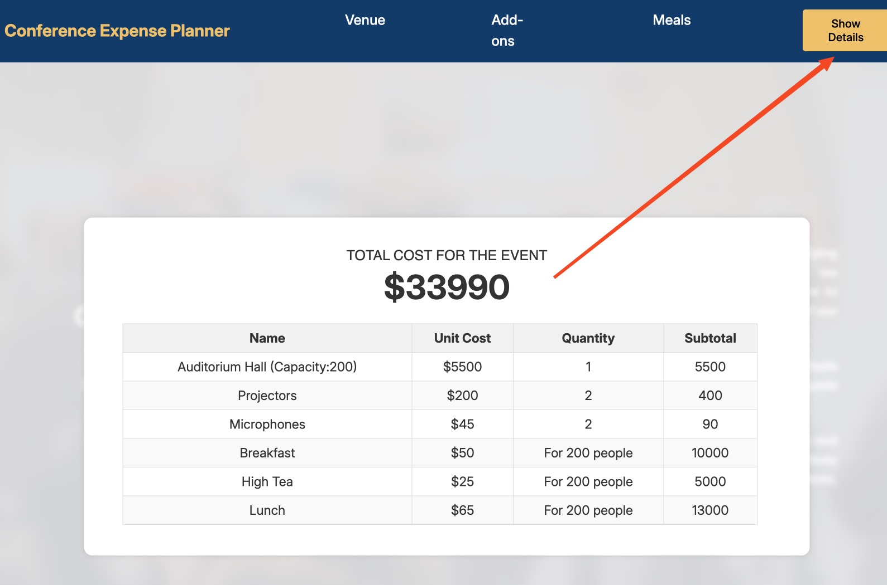

# Conference Event Planner Project

### Project Context 
Alejandre manages a venue for business conferences. Her parent company, "BudgetEase" wants to hire you to develop a website so BudgetEase customers can price their conference events easily.

The application's requirements include allowing users to select and price the rooms in the conference center, add-on selections, like microphones and projectors, and meals for a given number of guests.

### The BudgetEase conference expense planner features will include:

- A dynamic user interface that updates in real time based on user selections
- Components for venue selection, add-ons, and meal options
- Redux integration using Redux Toolkit to manage state changes
- Redux slices to manage different section states
- Display selected items and their costs with a table in a pop-up window
- Calculate and display subtotals and total costs based on user selections

### Learning objectives

- Create React components: Create functional React components using component composition and nesting.
- Manage states with hooks: Implement React Hooks, specifically the useState and useEffect hooks. You will use hooks to manage component-level state and control the visibility of elements.
- Integrate Redux: Integrate Redux within an application using Redux concepts like actions, reducers, and the store.
- Render dynamic data: Dynamically render data fetched from an array of objects into the UI. You will map over arrays to generate lists of components.
- Handle events using conditional rendering: Handle user events such as button selection and trigger corresponding actions.

### Project tasks
- Setup the project environment
- Review the structure of the ConferenceEvent.jsx component
- Review the code for the venue module
- Combine Redux with components to manage updates and state changes
- Add logic to calculate subtotals and total cost
- Make a dynamic table to show chosen products, displaying the item name, unit cost, quantity, and overall costs for that item
- Create a web design for a comfortable user experience
- Deploy your website to a public hosting service

### In this project, I:

- Created function components
- Review the structure of the ConferenceEvent.jsx component
- Used Redux Toolkit slices to manage different parts of your application's states
- Implemented Redux actions, reducers and the Redux store to increment and decrement stored values and dynamically display those values.
- Calculated and displayed costs using arrays and the map() function to iterate over the arrays
- Made a dynamic table to show selected products, displaying the item names, unit cost, quantity, and subtotal for that item
